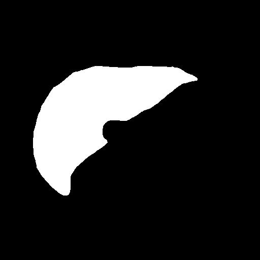

<h2>Tensorflow-Image-Segmentation-CT-Liver (2024/05/15)</h2>

This is the first experimental Image Segmentation project for CT-Liver based on
the <a href="https://github.com/sarah-antillia/Tensorflow-Image-Segmentation-API">Tensorflow-Image-Segmentation-API</a>, and
<a href="https://drive.google.com/file/d/1etFEBSESEUhDIXOroyjSnqK4yGjdaMNU/view?usp=sharing">CT-Liver-ImageMask-Dataset-V1.zip</a>.
 

Actual Image Segmentation Sample for an image. 
<table>
<tr>
<th width="330">Input: image</th>
<th width="330">Mask (ground_truth)</th>
<th width="330">Prediction: inferred_mask_merged</th>
</tr>
<tr>
<td></td>

<td></td>
<td></td>
</tr>
</table>

 
In this experiment, we have used the simple UNet Model 
<a href="./src/TensorflowUNet.py">TensorflowSlightlyFlexibleUNet</a> for this Oral Cancer Segmentation. 
As shown in <a href="https://github.com/sarah-antillia/Tensorflow-Image-Segmentation-API">Tensorflow-Image-Segmentation-API</a>.
you may try other Tensorflow UNet Models: 

<li><a href="./src/TensorflowSwinUNet.py">TensorflowSwinUNet.py</a></li>
<li><a href="./src/TensorflowMultiResUNet.py">TensorflowMultiResUNet.py</a></li>
<li><a href="./src/TensorflowAttentionUNet.py">TensorflowAttentionUNet.py</a></li>
<li><a href="./src/TensorflowEfficientUNet.py">TensorflowEfficientUNet.py</a></li>
<li><a href="./src/TensorflowUNet3Plus.py">TensorflowUNet3Plus.py</a></li>
<li><a href="./src/TensorflowDeepLabV3Plus.py">TensorflowDeepLabV3Plus.py</a></li>

 

<h3>1. Dataset Citation</h3>
The original dataset used here has been taken from the following web-site. 
 
<b>
<a href="https://chaos.grand-challenge.org/Download/">
Combined  Healthy  Abdominal  Organ  Segmentation 
</a>
</b>

 

CHAOS dataset can be downloaded via the link below.  
 
https://doi.org/10.5281/zenodo.3362844 
 
All participants are considered to have read and accepted the Rules.  
The data is licensed under Attribution-NonCommercial-ShareAlike 4.0 International.   
The data can be downloaded via the link below: 
 
https://doi.org/10.5281/zenodo.3362844 
 
In your works, please give appropriate credit, provide 
<a href="https://chaos.grand-challenge.org/Publications/">a link</a> 
to the license, and indicate if changes were made. 
 
The citation information can be found in the 
<a href="https://chaos.grand-challenge.org/Publications/"><b>Publications and Citation</b> </a>page.

 

<h3>
<a id="2">
2 CT-Liver ImageMask Dataset
</a>
</h3>
 If you would like to train this CT-Liver Segmentation model by yourself,
 please download the jpg dataset from the google drive 
<a href="https://drive.google.com/file/d/1etFEBSESEUhDIXOroyjSnqK4yGjdaMNU/view?usp=sharing">CT-Liver-ImageMask-Dataset-V1.zip</a>
 
, which was derived by us from the original CT dataset (dcm and png) of CHAOS Train_Sets.
 

Please expand the downloaded ImageMaskDataset and place it under <b>./dataset</b> folder to be
<pre>
./dataset
└─CT-Liver
    ├─test
    │   ├─images
    │   └─masks
    ├─train
    │   ├─images
    │   └─masks
    └─valid
        ├─images
        └─masks
</pre>

<b>CT-Liver Dataset Statistics</b> 
 
 
As shown above, the number of images of train and valid dataset is not necessarily large. 
 

 
<b>Train_images_sample</b> 

 
<b>Train_masks_sample</b> 

 

<h3>
4 Train TensorflowUNet Model
</h3>
 We have trained CT-Liver TensorflowUNet Model by using the following
<a href="./projects/TensorflowSlightlyFlexibleUNet/CT-Liver/train_eval_infer.config"> <b>train_eval_infer.config</b></a> file.  
Please move to ./projects/CT-Liver and run the following bat file. 
<pre>
>1.train.bat
</pre>
, which simply runs the following command. 
<pre>
>python ../../../src/TensorflowUNetTrainer.py ./train_eval_infer.config
</pre>
<pre>
; train_eval_infer.config
; 2024/05/15 (C) antillia.com

[model]
model         = "TensorflowUNet"
generator     = False
image_width    = 512
image_height   = 512
image_channels = 3
input_normalize = False
num_classes    = 1
base_filters   = 16
base_kernels   = (5,5)
num_layers     = 8
dropout_rate   = 0.07
learning_rate  = 0.0001
clipvalue      = 0.5
dilation       = (2,2)
loss           = "bce_dice_loss"
metrics        = ["binary_accuracy"]
show_summary   = False

[dataset]
color_order   = "bgr"

[train]
epochs        = 100
batch_size    = 2
patience      = 10
;metrics       = ["iou_coef", "val_iou_coef"]
metrics       = ["binary_accuracy", "val_binary_accuracy"]
model_dir     = "./models"
eval_dir      = "./eval"
image_datapath = "../../../dataset/CT-Liver/train/images/"
mask_datapath  = "../../../dataset/CT-Liver/train/masks/"
create_backup  = False
learning_rate_reducer = True
reducer_patience      = 4
save_weights_only = True

[eval]
image_datapath = "../../../dataset/CT-Liver/valid/images/"
mask_datapath  = "../../../dataset/CT-Liver/valid/masks/"

[test] 
image_datapath = "../../../dataset/CT-Liver/test/images/"
mask_datapath  = "../../../dataset/CT-Liver/test/masks/"

[infer] 
images_dir    = "./mini_test/images"
output_dir    = "./mini_test_output"
merged_dir   = "./mini_test_output_merged"
;binarize      = True
sharpening   = True

[segmentation]
colorize      = True
black         = "black"
white         = "green"
blursize      = None

[mask]
blur      = False
blur_size = (3,3)
binarize  = False
;
threshold = 110
</pre>
 
The training process has stopped at epoch 100 as shown below.  
 
 
 
<a href="./projects/TensorflowSlightlyFlexibleUNet/CT-Liver/eval/train_metrics.csv">train_metrics.csv</a> 
 

 
<a href="./projects/TensorflowSlightlyFlexibleUNet/CT-Liver/eval/train_losses.csv">train_losses.csv</a> 
 

 

<h3>
5 Evaluation
</h3>
Please move to a <b>./projects/TensorflowSlightlyFlexibleUNet/CT-Liver</b> folder, 
and run the following bat file to evaluate TensorflowUNet model for CT-Liver. 
<pre>
./2.evaluate.bat
</pre>
<pre>
python ../../../src/TensorflowUNetEvaluator.py ./train_eval_infer_aug.config
</pre>
Evaluation console output: 

  
<a href="./projects/TensorflowSlightlyFlexibleUNet/CT-Liver/evaluation.csv">evaluation.csv</a> 
The loss (bce_dice_loss) score for this test dataset is very low, and accuracy very heigh as shown below. 
<pre>
loss,0.0361
binary_accuracy,0.9937
</pre>
 
<h3>
6 Inference
</h3>
Please move to a <b>./projects/TensorflowSlightlyFlexibleUNet/CT-Liver</b> folder 
,and run the following bat file to infer segmentation regions for images by the Trained-TensorflowUNet model for CT-Liver. 
<pre>
./3.infer.bat
</pre>
<pre>
python ../../../src/TensorflowUNetInferencer.py ./train_eval_infer_aug.config
</pre>
mini_test_images 
 
mini_test_mask(ground_truth) 
 

Inferred test masks (colorized as green) 
 
 

Inferred test masks_merged 
 
 

<b>Enlarged images and masks </b> 

<table>
<tr>
<th width="330">Image</th>
<th width="330">Mask (ground_truth)</th>
<th width="330">Inferred-mask-merged</th>
</tr>

<tr>
<td></td>
<td></td>
<td></td>
</tr>

<tr>
<td></td>
<td></td>
<td></td>
</tr>

<tr>
<td></td>
<td></td>
<td></td>
</tr>

<tr>
<td></td>
<td></td>
<td></td>
</tr>
<tr>
<td></td>
<td></td>
<td></td>
</tr>

</table>
 
 

<h3>
References
</h3>

<b>1. CHAOS Challenge - combined (CT-MR) healthy abdominal organ segmentation  </b>
A. Emre Kavur, N. Sinem Gezer, Mustafa Barış, Sinem Aslan, Pierre-Henri Conze, Vladimir Groza,  
Duc Duy Pham, Soumick Chatterjee, Philipp Ernst, Savaş Özkan, Bora Baydar, Dmitry Lachinov,  
Shuo Han, Josef Pauli, Fabian Isensee, Matthias Perkonigg, Rachana Sathish, Ronnie Rajan,  
Debdoot Sheet, Gurbandurdy Dovletov, Oliver Speck, Andreas Nürnberger, Klaus H. Maier-Hein,  
Gözde Bozdağı Akar, Gözde Ünal, Oğuz Dicle, M. Alper Selver, 
 
Medical Image Analysis,Volume 69,2021,101950,ISSN 1361-8415, 
https://doi.org/10.1016/j.media.2020.101950. 

<pre>
https://www.sciencedirect.com/science/article/abs/pii/S1361841520303145
</pre>
 
<b>2. Fully Automatic Liver and Tumor Segmentation from CT Image Using an AIM-Unet.</b>  
Özcan F, Uçan ON, Karaçam S, Tunçman D.  

Bioengineering (Basel). 2023 Feb 6;10(2):215. doi: 10.3390/bioengineering10020215.  
PMID: 36829709; PMCID: PMC9951904. 

<pre>
https://www.ncbi.nlm.nih.gov/pmc/articles/PMC9951904/
</pre>

